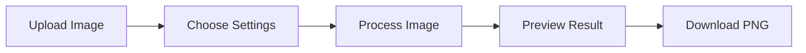

# 🎮 Minecraft Image Processor


> Transform your favorite images into stunning Minecraft block art! Upload any image and watch it come to life with authentic Minecraft blocks. 🖼️➡️🎲

[](https://nextjs.org/)
[](https://fastapi.tiangolo.com/)
[](https://www.python.org/)

## ✨ Features

- 🖼️ **Universal Upload** - Support for all common image formats
- 🎨 **Smart Color Matching** - Advanced algorithm for accurate block selection
- 🔍 **Adjustable Resolution** - Choose from 32×32 up to 128×128 grid sizes
- ⚡ **Real-time Preview** - See your creation come to life instantly
- 💾 **Easy Export** - Download as PNG with one click

## 🚀 Quick Start

### Prerequisites

- Node.js 14+ and npm
- Python 3.8+
- Git

### ⚙️ Installation

<details>
<summary><b>Frontend Setup</b></summary>

```bash
# Clone the repository
git clone https://github.com/shivaansh74/minecraft-image-processor.git

# Navigate to frontend
cd frontend

# Install dependencies
npm install

# Start development server
npm run dev
```
✅ Frontend will be live at http://localhost:3000
</details>

<details>
<summary><b>Backend Setup</b></summary>

```bash
# Navigate to backend
cd backend

# Create virtual environment
python -m venv venv

# Activate virtual environment
venv\Scripts\activate  # Windows
source venv/bin/activate  # Mac/Linux

# Install dependencies
pip install -r requirements.txt

# Launch server
uvicorn main:app --reload
```
✅ API will be available at http://localhost:8000
</details>

## 🎯 How It Works



1. 📤 **Upload** any image through our intuitive interface
2. ⚙️ **Configure** your desired grid size and settings
3. 🔄 **Process** using our advanced block-matching algorithm
4. 👀 **Preview** your creation in real-time
5. 💾 **Download** your masterpiece

## 🏗️ Architecture

```
frontend/            # Next.js web application
├── src/
│   ├── components/  # React components
│   ├── pages/      # Route components
│   └── styles/     # CSS modules
└── public/         # Static assets

backend/            # FastAPI service
├── processors/     # Image processing logic
├── models/        # Data models
└── utils/         # Helper functions
```

## 🗺️ Future Features

- [ ] Export to Minecraft .schematic files
- [ ] 3D structure support
- [ ] Custom block palettes
- [ ] Advanced dithering options
- [ ] More block types for better color matching

## 🛠️ Technologies Used

- **Frontend**: Next.js, React, TailwindCSS
- **Backend**: FastAPI, Python
- **Image Processing**: OpenCV, PIL, NumPy
- **Machine Learning**: Scikit-learn for color matching

## 🤝 Contributing

This is a personal project to demonstrate full-stack development skills. However, feedback and suggestions are always welcome! Feel free to:

- [Report bugs](https://github.com/shivaansh74/minecraft-image-processor/issues)
- [Suggest improvements](https://github.com/shivaansh74/minecraft-image-processor/issues)
- [Connect with me](https://github.com/shivaansh74)

---

<div align="center">

**Developed by [Shivaansh Dhingra](https://github.com/shivaansh74)**

*A demonstration of full-stack development, image processing, and creative coding skills*

</div>
